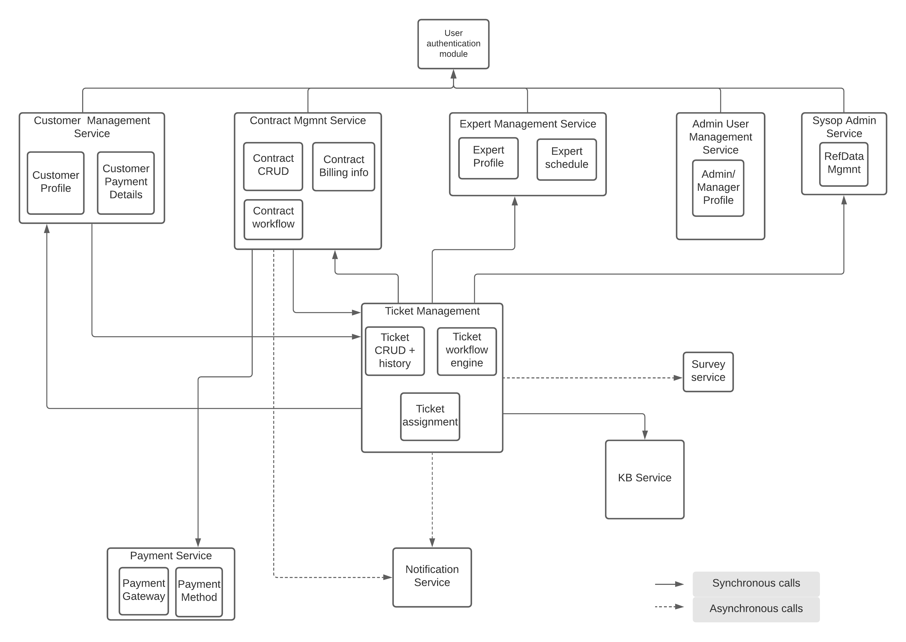
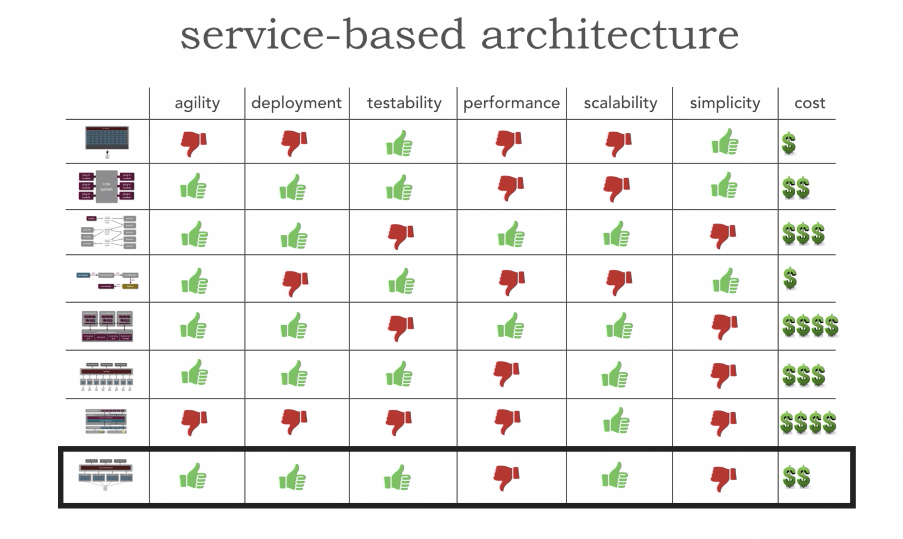

# Use of service based architecture
## Status
Accepted
## Context
The current system is a modularised monolith system with all components in a single deployable service. 
This structure would have probably been chosen for its simplicity and cost efficiency.

This monolith structure is however causing the following business impact:
* Change is difficult and risky- whenever a change is made, it takes too long and something else usually breaks.
* It is hard to change the data structure, since it has multiple dependencies.
* Hard to maintain, observe and test.
* Same service and database is used for different kinds of requirements 
  i.e. for reporting and real-time transactions. This causes issues in both functionalities.

The new architecture should have these [properties](../docs/system_characteristics.md)

## Decision
We see that different parts of the system have different architectural requirements.

* The customer directly and indirectly interacts with some parts of the system 
(e.g. customer management, contract management and ticket management). 
These parts have to be available, scalable and elastic to avoid customer frustration.
* The ticket management and contract management parts have to be fault-tolerant and recoverable.
i.e. The current system experiences loss of ticket data which is unacceptable.
One major cause for this could be because of the way the ticket workflow is managed.
* The ticket assignment module should also be easy to evolve enabling better ticket to expert matching.
Currently, many customers face the issue of incorrect expert being assigned to their tickets.
* Enhancement and evolution of business process can only happen if the managers get appropriate reports 
when needed and in the format that is needed for analysis.
* Overall the system should be maintainable, testable and observable. 
  We should be able to identify what the issue is when it occurs.

This makes it clear that we need to break the monolith. 
The communication between these modules needs to be both synchronous and asynchronous 
as seen 
Referring to the available architectural principles and a comparison between them, 
shows us that we have two candidates that fulfil the above requirement : 
*service based* and *microservice architecture*.

Image source: [Software Architecture Fundamentals, Second Edition Neal Ford, Mark Richards](https://learning.oreilly.com/videos/software-architecture-fundamentals/9781491998991/9781491998991-video317001?autoplay=false)

Both Microservice architecture and Service based architecture give us similar architectural benefits.
However, we decided to chose Service based architecture because: 
* We believe that for the current (and the near future) requirements 
  we do not need the high granularity and scalability which microservice offer over Service based.
* Moreover, Microservice architecture requires a devops maturity which 
  a team handling monolith service might lack.
* Choosing Service based Architecture also allows us to migrate in steps where we can first move the module to a separate service 
  but let the database remain untouched. 
* This will also help us start solving the burning issues even before 
  we reach the final goal.
* This will also prove to be a stepping stone between the current monolith 
  and a probable future microservice if Sysop squad truly expands.
  
## Consequences
* Comprehensible and manageable migration
* Quicker solution to burning problems
* Much higher maintainability and testability leading to more stable system  
* Manageable coarse grained services
* Domain specific teams to enable better business process evolution
