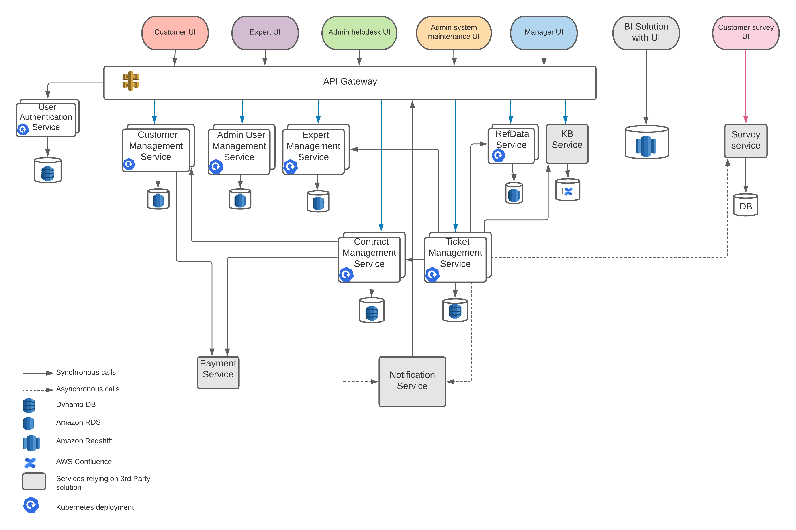

# Deployment diagram

As it stated in the [Cloud-based deployment](adr/2021_05_01_cloud_provider.md) ADR we are going to deploy to AWS with Elastic Kubernetes Service. 
We're also planing to use other managed solutions like Dynamodb, RDS and Redshift.
Asynchronous communication will be backed by SQS.

