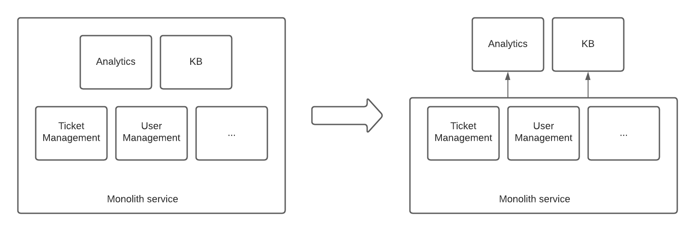
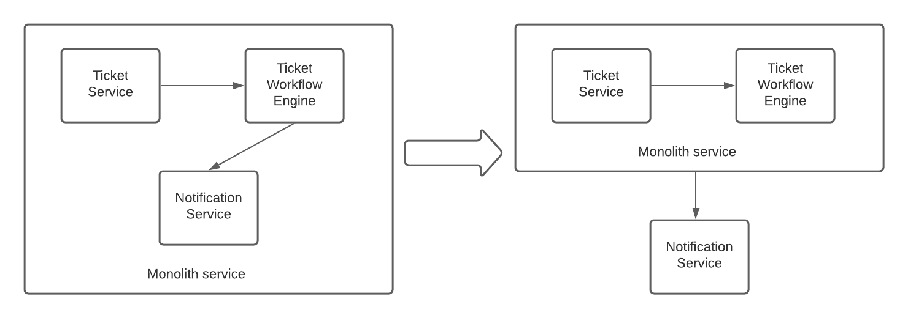
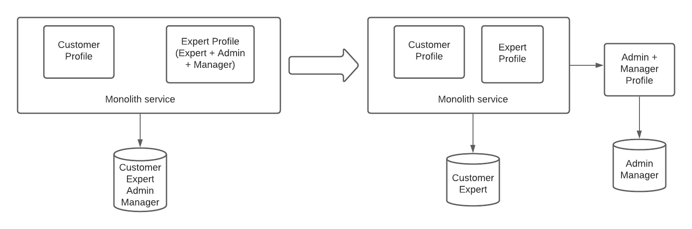
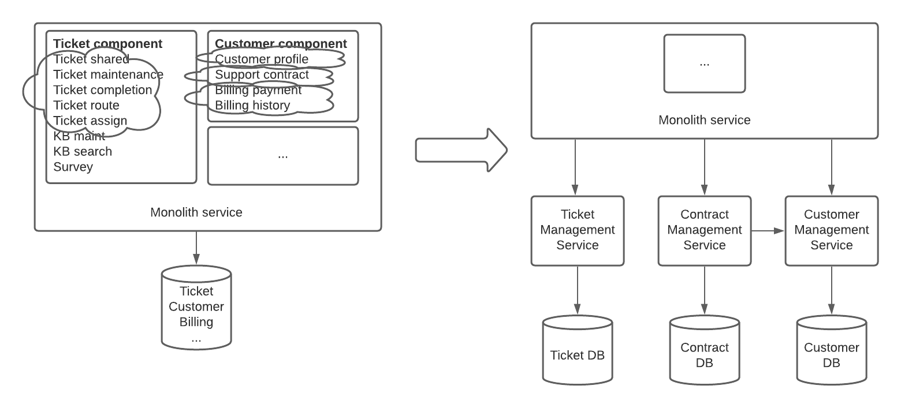

# Migration Plan

### Problems / Priorities

There are 2 major problems in the current architecture:

* There are complaints from call center operators that the system is not always available for ticket entry -> **Availability**
* It’s hard to make a change on the existing solution, it takes long and something else usually breaks -> **Maintainability**

Above-mentioned problems are typical downsides of monolithic architecture. We decided to re-engineer our architecture [(adr)](../adr/2021_04_30_1_service_oriented_architecture.md) and to switch to service based architecture gradually in order to mitigate those problems. This way, we’ll make sure changes don’t affect other parts of the system. Moreover, we’ll define priorities for service availabilities and we’ll deliver high availability for customer facing applications.

### Guidelines / Principals

During re-engineering of the system, we considered;
* prioritizing the resolution of the problems which give bad experience to the customers right now   
* [these suggestions](https://martinfowler.com/articles/break-monolith-into-microservices.html) to split existing structure into smaller parts
* Having small/measurable steps and delivering ready components

### Migration steps:
* **Step #1** Start migration with problematic and decoupled entities
    * **Motivation**
        * We suspect the *analytics module* for the **availability** issues; running heavy queries on production database may cause load and performance degradation
        * Also, it’s easiest to migrate decoupled entities which are not customer facing. 
        * For these purposes, we decided to migrate *analytics* and *knowledge base (KB)* modules
    * **Expected result**
        * We plan to have 2 separate new components; *analytics* and *KB*. Since *analytics* will have a separate database, production system load will severely reduce and customer experience will be better
    * **How to achieve step #1**
        * As part of analytics [adr](../adr/2021_04_27_1_separated_warehouse.md) and KB [adr](../adr/2021_04_28_1_kb_tool.md), new databases will be created for new integrations 
        * Existing monolith service will replicate *analytics* and *KB* related data to new databases 
        * We will take a snapshot of needed previous *analytics* and *KB* data from existing database and will store in the new databases (we will use an extract-transform-load (ETL) tool for this purpose)
        * *Analytics* and *KB* will be served through new integrations with required changes on current system 
        * We will decommission *analytics* and *KB* functionalities of monolith service
    

*Figure - migration plan step #1*

* **Step #2** Migrate less dependant components
    * **Motivation**
        * Less dependant components - which are called but don’t give call - (e.g. _notification service_) are easier to migrate rather than core components (e.g. _ticket workflow engine_) - which have many touchpoints. Migration of less dependent components doesn’t require making a connection back to the monolith. 
        * We decided to migrate these less dependent components at this step: _notification service, survey manager, payment service_
    * **Expected result**
        * Load and complexity in the monolith will reduce even more 
        * Services that core components need will be ready in the new setup
    * **How to achieve step #2**
        * Once new _notification service, survey manager and payment service_ integrations are done -we plan to place 3rd party softwares, _needs adr_-, required changes will be made in existing service separating/abstracting these modules from main structure 
        * New databases will be ready for new 3rd party applications 
        * If we need to keep old data for a while (for compliance/reporting etc. reasons), we need to take a snapshot of existing data (using an ETL tool) and store them in the new databases 
        * We make changes on monolith service to use separated components one by one - **we prefer small/measurable steps** - first, use new _notification service_, if it works as expected, decommission old notification codes/data/usage in the monolith - repeat for other components 
        * We keep old code and data for a while until we make sure a successful and smooth transition - we always need a fallback plan - we can go back to previous state if needed

*Figure - migration plan step #2*

* **Step #3** Decouple vertical components
    * **Motivation**
        * Due to the fact that changes break somewhere else in current structure, we decided service based architecture and we decouple relevant services and data as much as we can (vertical decoupling)
        * We decided to separate out _admin/manager profile service_ along with its data and _reference data service_ on this step
    * **Expected result**
        * Load and complexity in the monolith will reduce even more
        * We will experience our own code in the new setup before the migration of other heavy components
        * We will introduce maintainable components
    * **How to achieve step #3**
        * Extract or rewrite existing code pieces, build new services based on them
        * Like in the previous steps, we copy needed data into the new databases
        * We make changes in the monolith in a way that it uses extracted vertical components
        * We decommission these functionalities from the monolith

*Figure - migration plan step #3*

* **Step #4** Decouple the rest of **capabilities**
    * **Motivation**
        * In the final phase, we focus on existing capabilities (not code) which can be represented with a separate service
        * Capability focus will help improving our team structure and responsibilities
    * **Expected result**
        * We finalize the re-engineering of the system 
        * We have all the components/services in the new setup
        * Monolith will be decommissioned
    * **How to achieve step #4**
        * We decided to separate the rest of modules into _customer management system, expert management system, ticket management system, contract management system_ services
        * Different from step #3, here there is a possibility to lose data if we don’t plan the transition properly because these services process **real-time data**
        * Transition can be made at the very low traffic period (e.g. in the middle of night)
        * Old data can be copied into new databases using ETL
        * As mentioned in step #3, we prefer small steps - changes will be made capability by capability
        * We plan to introduce a replicator on top of the capability that we want to decouple - it’ll start to replicate changes in old and new services. After a successful transition, we can stop using old service for the relevant function and decommission it
            * Similar to step #2, we need to decouple less dependant capability first (_Customer management service_ should be decoupled before _contract management service_ since latter depends on former)

*Figure - migration plan step #4*